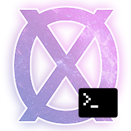

[](https://github.com/GorlikItsMe/OnexExplorerCli/actions)
[](https://github.com/GorlikItsMe/OnexExplorerCli/actions)
[](https://github.com/GorlikItsMe/OnexExplorerCli/actions)
[](https://github.com/GorlikItsMe/OnexExplorerCli/actions)
[](https://github.com/GorlikItsMe/OnexExplorerCli/actions)

<p align="center">
  
</p>

# OnexExplorerCli

OnexExplorerCli is an open-source command-line tool for unpacking and repacking .NOS data files from the game NosTale. It is based on the original [OnexExplorer](https://github.com/Pumba98/OnexExplorer) GUI application. Huge thanks to [Pumba98](https://github.com/Pumba98) for his work.

> [!WARNING]
> This project is a work-in-progress and not yet finished. Everything can change.

## Features

- **List entries** — display the entry table of any .NOS archive with type, size, and compression info; JSON output via `--json`
- **Show entry details** — detailed information about individual entries; JSON output via `--json`
- **Extract entries** — decompress/decrypt entries to disk; images are auto-converted to PNG
- **Download from CDN** — fetch .NOS archives directly from the Gameforge CDN with SHA1 verification


## Supported .NOS file formats

| Archive name | Description |
|---|---|
| NSgtdData | Items, quests, skills, mobs etc. data |
| NSlangData | `_code_lang_list` (ztsXXXe) |
| NScliData | `constring.dat` |
| NSetcData | Word list for Memory & TabooStr.lst |
| NS4BbData | Big images |
| NSipData | Icons |
| NStpData | Map and model textures |
| NStpeData | Effect textures |
| NStpuData | UI textures |
| NStcData | Map grids |

## Unsupported or partially supported .NOS file formats

The following archives are **not yet supported**:

| Archive name | Description |
|---|---|
| NSmpData | Monster-related sprites |
| NSppData | Player-related sprites |
| NSmnData | Mob-related sprite infos |
| NSpnData | Player-related sprite infos |
| NSmcData | Monster-related animation kits |
| NSpcData | Player-related animation kits |
| NStgData | 3D Models |
| NStgeData | 3D VFX models |
| NStuData | Map configs |
| NSeffData | VFX configs |
| NStsData | — |
| NStkData | — |
| NSemData | — |
| NSesData | — |
| NSedData | — |
| NSgrdData | — |
| NSpmData | — |

> [!NOTE]
> Some archives can be **opened and listed** but **extraction** of entry bodies may fail or produce incorrect data if the entry type or compression is not yet handled.

## How to use it

### Commands

```
OnexExplorerCli download [-o <output-dir>] [--build-id <id>] [--all] <archive-names...>
OnexExplorerCli extract <file> -o <output-dir> [--entry <ids...>]
OnexExplorerCli list <file> [--json]
OnexExplorerCli info <file> [--entry <ids...>] [--json]
```

### Global options

| Option          | Description                          |
|-----------------|--------------------------------------|
| `-h, --help`    | Print help message and exit          |
| `-v, --version` | Print the version number and exit    |

### `download` — fetch archives from the Gameforge CDN

Fetches `.NOS` archive files from the Gameforge CDN. Downloads the patch manifest, resolves each archive name against it, and streams the file to disk with SHA1 verification.

| Option                 | Description                                          |
|------------------------|------------------------------------------------------|
| `-o, --output <dir>`   | Target directory for downloaded files (required)     |
| `--build-id <id>`      | Build version to fetch from (default: `latest`)      |
| `--all`                | Download all archives in the manifest                |
| `archive-names...`     | One or more archive names from the manifest          |

Resolution tries an exact `file`-field match first, then falls back to a bare filename match. An error is reported if a name matches more than one manifest entry. Files already present on disk with a matching SHA1 are skipped.

**Examples:**
```bash
# Download specific archives
OnexExplorerCli download -o ./downloads NSipData.NOS NostaleData\\NSipData.NOS

# Download all archives from a specific build
OnexExplorerCli download -o ./downloads --build-id 12345 --all
```

### `extract` — extract entries from a .NOS archive

Reads a .NOS archive and extracts entries to disk. Image entries (Texture, Icon, Image4B, TileGrid) are automatically converted to PNG.

| Option               | Description                                        |
|----------------------|----------------------------------------------------|
| `file`               | Path to the .NOS file (required)                   |
| `-o, --output <dir>` | Output directory (required)                        |
| `--entry <ids...>`   | Entry IDs to extract (repeatable; default: all)    |

**Examples:**
```bash
# Extract all entries
OnexExplorerCli extract path/to/file.NOS -o ./output

# Extract specific entries by ID
OnexExplorerCli extract path/to/file.NOS -o ./output --entry 0 1 2
```

### `list` — list entries in a .NOS archive

Displays the entry table of a .NOS archive: ID, name, type, compression status, and sizes.

| Option    | Description                                    |
|-----------|------------------------------------------------|
| `file`    | Path to the .NOS file (required)               |
| `--json`  | Output as a JSON array (pipeable)              |

**Examples:**
```bash
# Human-readable table
OnexExplorerCli list path/to/file.NOS

# JSON output (pipeable)
OnexExplorerCli list path/to/file.NOS --json | jq '.[] | select(.type == "Icon")'
```

### `info` — show entry details

Displays detailed information about entries in a .NOS archive: ID, name, type, creation date, compression, file offsets, and sizes.

| Option             | Description                                        |
|--------------------|----------------------------------------------------|
| `file`             | Path to the .NOS file (required)                   |
| `--entry <ids...>` | Entry IDs to inspect (repeatable; default: all)    |
| `--json`           | Output as JSON (single entry or array for multiple)|

**Examples:**
```bash
# Show all entries
OnexExplorerCli info path/to/file.NOS

# Show specific entries
OnexExplorerCli info path/to/file.NOS --entry 0 1 2

# JSON output for a single entry
OnexExplorerCli info path/to/file.NOS --entry 0 --json
```

## Build and run

### Build and run the standalone CLI

```bash
cmake -S standalone -B build/standalone
cmake --build build/standalone
./build/standalone/OnexExplorerCli --help
```

### Build and run the test suite

```bash
cmake -S test -B build/test
cmake --build build/test
CTEST_OUTPUT_ON_FAILURE=1 cmake --build build/test --target test

# or run the test executable directly:
./build/test/OnexExplorerTests
```

To collect code coverage information, run CMake with the `-DENABLE_TEST_COVERAGE=1` option.

### Run clang-format

```bash
cmake -S test -B build/test

# view changes
cmake --build build/test --target format

# apply changes
cmake --build build/test --target fix-format
```

See [Format.cmake](https://github.com/TheLartians/Format.cmake) for details.
Dependencies can be installed via pip:

```bash
pip install clang-format==14.0.6 cmake_format==0.6.11 pyyaml
```

### Build the documentation

The documentation is automatically built and [published](https://gorlikitsme.github.io/OnexExplorerCli) whenever a [GitHub Release](https://help.github.com/en/github/administering-a-repository/managing-releases-in-a-repository) is created.
To manually build documentation:

```bash
cmake -S documentation -B build/doc
cmake --build build/doc --target GenerateDocs
# view the docs
open build/doc/doxygen/html/index.html
```

You will need Doxygen, jinja2 and Pygments installed on your system.

### Build everything at once

```bash
cmake -S all -B build
cmake --build build

# run tests
./build/test/OnexExplorerTests
# format code
cmake --build build --target fix-format
# run standalone
./build/standalone/OnexExplorerCli --help
# build docs
cmake --build build --target GenerateDocs
```

## FAQ

> VS Code / clangd shows "file not found" errors for project headers

After building, generate a `compile_commands.json` and symlink it to the project root so clangd can resolve include paths:

```bash
cmake -S standalone -B build/standalone -DCMAKE_EXPORT_COMPILE_COMMANDS=ON
ln -sf build/standalone/compile_commands.json compile_commands.json
```

Then restart clangd in VS Code (`Ctrl+Shift+P` → "clangd: Restart").

If using the `all` build, point to that instead:

```bash
cmake -S all -B build -DCMAKE_EXPORT_COMPILE_COMMANDS=ON
ln -sf build/compile_commands.json compile_commands.json
```

## Related projects and alternatives

- [**OnexExplorer**](https://github.com/Pumba98/OnexExplorer): Original Qt GUI application where most of the work was made.
